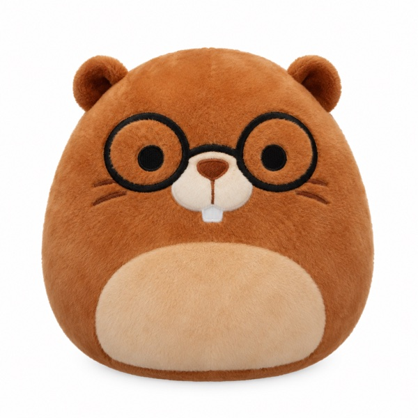
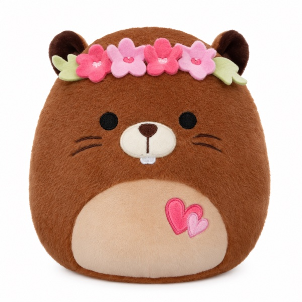
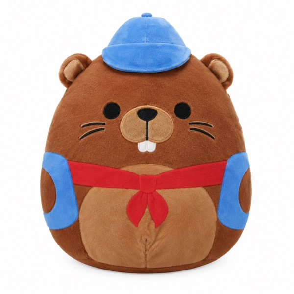
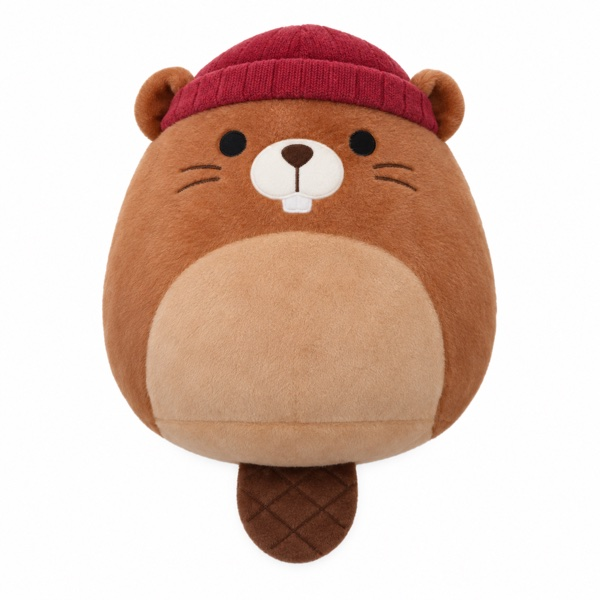

Welcome to **Beavitus University**, a tiny university inhabited by four curious beavers.

Don studies Statistics with a minor in Engineering.
Rosie studies Sociology with a minor in Economics.
Dobby studies Literature with a minor in American Studies.
Melo studies Arts and spends much of the time in a tiny garage, making things,
testing ideas, and starting projects that may or may not work.

This blog is their shared notebook.

Some weeks, one of them learns something new and writes it down. Sometimes, two
or more beavers get together to explore the same question from different
perspectives. Every now and then, they meet a new or visiting student, and a
conversation turns into a story worth keeping.

There is no grand curriculum here — just four little beavers, learning one thing at a time.

## Meet the Beavers

::: {.beaver-grid}

::: {.beaver-card}
{fig-alt="Don, a beaver with round glasses"}

[Don]{.beaver-name}

[Statistics major · Engineering minor]{.beaver-major}

Interested in statistics, machine learning, AI, computation, and understanding
how things can be measured or modeled.
:::

::: {.beaver-card}
{fig-alt="Rosie, a beaver with a flower crown"}

[Rosie]{.beaver-name}

[Sociology major · Economics minor]{.beaver-major}

Interested in people, institutions, incentives, markets, and the ways societies
organize themselves.
:::

::: {.beaver-card}
{fig-alt="Dobby, a beaver with a blue cap and red scarf"}

[Dobby]{.beaver-name}

[Literature major · American Studies minor]{.beaver-major}

Interested in literature, language, history, culture, nature, and the ways
people make meaning through stories.
:::

::: {.beaver-card}
{fig-alt="Melo, a beaver with a red beanie"}

[Melo]{.beaver-name}

[Arts major]{.beaver-major}

Spends a lot of time in a tiny creative garage — *Melo's Garage* — making
things, testing ideas, sketching, experimenting, and starting small projects
that may or may not work.
:::

:::

## About the Notes

::: {.note-formats}

::: {.note-format}
[Learning Notes]{.format-name}

A single beaver learns something new and writes down what they found
interesting. *Don learns about causal inference.*
:::

::: {.note-format}
[Conversations]{.format-name}

Two or more beavers explore the same question from different perspectives —
Don might look at it statistically while Rosie thinks about its social or
economic implications.
:::

::: {.note-format}
[Encounters]{.format-name}

A beaver meets a new or visiting student, and their conversation leads to an
idea worth writing down.
:::

:::

## Upcoming

<!-- Remove this card once the post is published (set draft: false in the post). -->

::: {.upcoming-card}
{fig-alt="Don"}

::: {.upcoming-body}
[Coming October 11, 2026]{.upcoming-date}

[Don Learns Causal Inference]{.upcoming-title}

Don has been learning about causal inference: how we move from observing that
two things happen together to asking whether one actually causes the other.

His first note will explore the basic ideas behind causal questions, why
prediction and causation are different, and how statisticians try to reason
about causes using imperfect observational data.

[Don · Learning Notes · Causal Inference]{.upcoming-tags}
:::
:::

## Recent Notes

[New notes appear here as they're published.]{.notes-hint}

::: {#recent-notes}
:::

::: {.beavitus-disclaimer}
The plush toys featured on this website are privately owned and photographed.
The characters, names, personalities, stories, and other creative content
presented on this site are original creations for this personal project.

This website is an independent personal project and is not affiliated with,
sponsored by, endorsed by, or officially associated with Squishmallows,
Jazwares, or Kelly Toys. All trademarks and related intellectual property
belong to their respective owners.
:::
